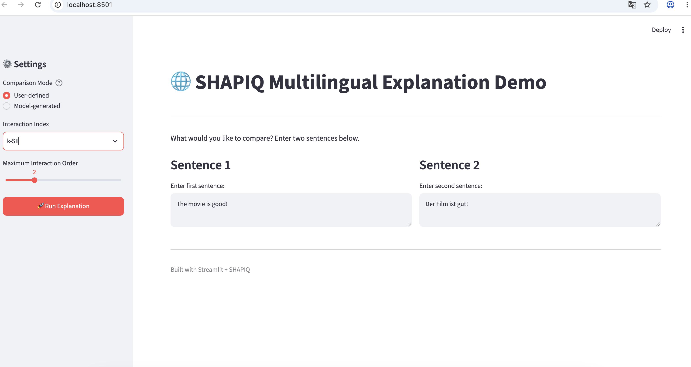
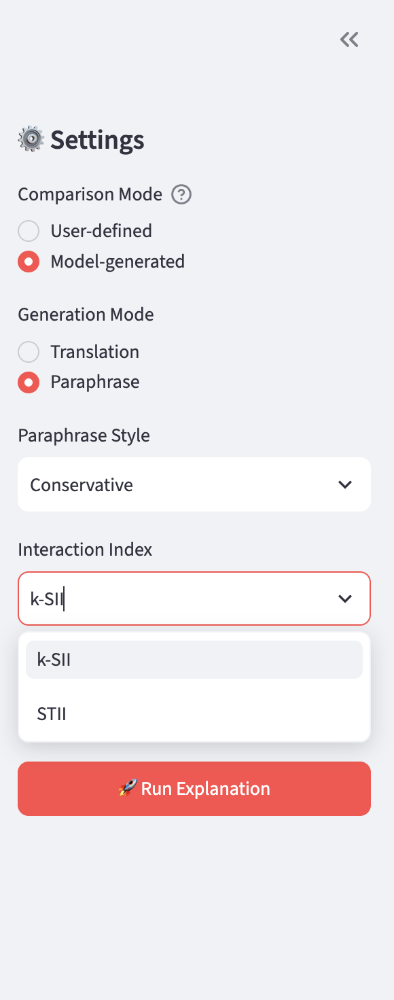
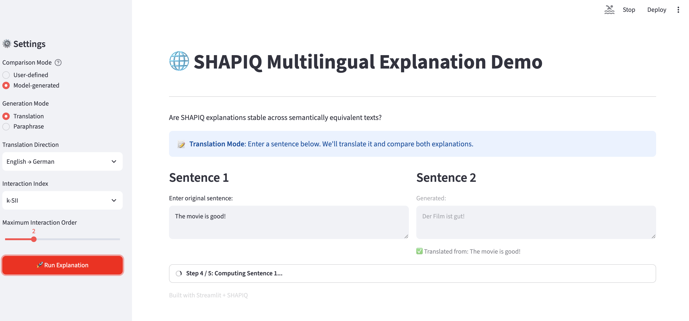

# 🌐 Multilingual Explanation Comparison Demo
------------------------------------------------------------------------

## 1. Overview

This demo is designed for the **Multilinguality & Robustness** topic
proposed in the SHAPIQ project.

The goal is not to evaluate machine translation or paraphrase quality
itself, but to investigate:

> Are SHAPIQ explanations, especially interaction values, stable across
> semantically equivalent texts such as translations or paraphrases?

The demo showcases the newly implemented `TextImputer` together with SHAPIQ interaction explanations.

------------------------------------------------------------------------

## 2. Getting Started

### Prerequisites

- Python 3.12 or higher
- Git
- Optional: conda for environment management

### Installation

#### Step 1: Clone the Repository

```bash
git clone https://github.com/ddddxx1/shapiq.git
cd shapiq
git checkout Multilingualdemo-Liang
```

#### Step 2: Set Up Environment

```bash
# Using conda (recommended)
conda create -n shapiq_demo python=3.12
conda activate shapiq_demo
```

#### Step 3: Install Dependencies

```bash
# Install from source (development mode)
pip install -e .

# Install extra dependencies for text explanation
pip install -e ".[text]"

# Or install all required packages directly
pip install torch transformers shapiq streamlit matplotlib numpy scipy nltk
```

#### Step 4: Set Python Path (if needed)

```bash
export PYTHONPATH=src:$PYTHONPATH
```
Note: The demo requires models to be downloaded on first run. Model caching is enabled, so subsequent runs will be faster.


### Usage

After installation, you can run the demo in two ways:

#### Web Interface (Recommended)

```bash
streamlit run demo/multilingual/app.py
```
You will see the Streamlit app running at http://localhost:8501 in your browser. (Google Chrome is better way to open it.)

#### Command Line Interface

```bash
PYTHONPATH=src python demo/multilingual/Multilingual_Expanation_Compasion.py
```

Follow the terminal prompts to compare explanations.

Note: If you encounter any issues or errors, please consult an AI assistant or refer to the error messages for troubleshooting.

------------------------------------------------------------------------

## 3. Usage

------------------------------------------------------------------------

## 4. Comparison Modes

Two comparison modes are available.

### 4.1 User-defined Comparison

The user can directly provide two sentences to compare.

Example:



No text generation model is used.

------------------------------------------------------------------------

### 4.2 Model-generated Comparison

The user provides one original sentence. The second sentence is automatically generated.

Two generation modes are supported:

-   Translation

-   Paraphrase


------------------------------------------------------------------------

## 5. Translation

### Supported Languages & Models

The current implementation supports:

-   English → German by using Model:

``` text
Helsinki-NLP/opus-mt-en-de
```

-   German → English by using Model:

``` text
Helsinki-NLP/opus-mt-de-en
```

The translation models will be loaded only when translation mode is selected.

------------------------------------------------------------------------

## 6. Paraphrase

The current implementation provides three paraphrase styles.

### Conservative

Minimal changes.

The model is instructed to replace only a few words with synonyms while
preserving sentence structure and meaning.

Generation is deterministic.

### Moderate

Clearly different wording and a noticeably different sentence structure.

The exact meaning and important information should remain unchanged.

Sampling is enabled.

### Structural

The grammatical structure should be visibly changed.

The model is explicitly instructed to preserve:

-   entities
-   facts
-   sentiment
-   relationships

and not introduce new information.

### Paraphrase Model

``` text
Qwen/Qwen2.5-0.5B-Instruct
```

The prompt uses the tokenizer chat template and requests exactly one paraphrased sentence without explanations or quotation marks.Generated text cannot be manually edited inside the demo workflow.

------------------------------------------------------------------------

## 7. User Interface

### Web Interface (Streamlit) — Recommended

The recommended way to explore the demo. Provides an interactive dashboard with real-time visualization.

use command line: 

``` text
streamlit run demo/app.py
```

Then open your browser to http://localhost:8501


### Interactive Workflow

#### Step 1: Choose Comparison Mode (Sidebar)

| Mode | Description |
|------|-------------|
| **User-defined** | Enter two sentences manually for comparison |
| **Model-generated** | Enter one sentence, auto-generate the second via translation or paraphrase |

---

#### Step 2: Select Generation Mode (Model-generated in Sidebar only)

| Mode | Description |
|------|-------------|
| **Translation** | Translate between English and German |
| **Paraphrase** | Generate a paraphrase by choosing three paraphrase styles(Conservative\Moderate\Structural)|

---

#### Step 3: Choose Explanation Settings (Sidebar)

| Setting | Options | Description |
|---------|---------|-------------|
| **Interaction Index** | k-SII, STII | Shapley interaction indices |
| **Maximum Order** | 1–5 (default 2) | Maximum interaction order to compute |

| Index | Full Name | Description |
|-------|-----------|-------------|
| **k-SII** | k‑Shapley Interaction Index | Standard Shapley interaction index. Suitable for general comparison. First-order values are non-zero.|
| **STII** | Shapley‑Taylor Interaction Index | Derived from Taylor expansion. More sensitive to higher-order interactions. First-order values are non-zero. |



---

#### Step 4: Enter Sentences (Main Area)

- **Sentence 1**: The reference sentence (or example sentence in Model-generated mode)
- **Sentence 2**: The comparison sentence (auto-generated in Model-generated mode)



---

#### Step 5: View Results

After clicking **"Run Explanation"**, the following outputs are displayed:

**1. First-Order Interaction Values (Bar Charts)**


These charts show the individual contribution of each word to the model's prediction.
- Positive bars indicate words that push the prediction toward the target class (positive sentiment)
- Negative bars indicate words that push the prediction away
- Separate charts are shown for Sentence 1 and Sentence 2
- Separate tabs distinguish Removal and MLM Infilling strategies
- Hover over bars to see exact values

**Interactive Features:**
- **Zoom**: Mouse wheel or button to zoom in/out
- **Reset**: Double-click the chart or click the reset button to restore default view
- **View Values**: Hover or click on bars to see exact contribution values
- **Toolbar**: Zoom, reset, and download as PNG buttons available in the top-right corner
- **View Switching**: Bar Chart Mode or Table Mode: Click the "Table View" button in the chart toolbar to switch from bar chart to a numerical table, showing exact contribution values for each word — ideal for copying or exporting data, switch between modes anytime to suit different needs: visual analysis vs. precise data inspection


**2. Force Plots (Interactive Visualizations)**


These are the official SHAPIQ force plots that visualize both individual and interaction effects.
- Each word is shown as a colored block
- **Red blocks** indicate positive contributions toward the target class
- **Blue blocks** indicate negative contributions (pushing toward the opposite class)
- The size of each block represents the magnitude of contribution
- The base value (center line) shows the prediction without any features
- 4 plots total: Sentence 1/2 × Removal/MLM Infilling
- Automatically saved as PNG files

**Interactive Features:**
- **Zoom**: zoom in/out button for each plot

**Interpretation Tips:**
- Compare the same word across Sentence 1 and Sentence 2 to check cross-lingual stability
- Compare Removal vs MLM Infilling to see how context affects the explanation
- Large red blocks indicate strong positive sentiment drivers
- Large blue blocks indicate strong negative sentiment drivers


### CLI Terminal Interfaces

The demo also provides a CLI terminal interface.

For terminal-based interaction: 

``` text
PYTHONPATH=src python demo/Multilingual_Expanation_Compasion.py
```

No Gradio. No Streamlit.

Menus use numbered choices.

Example:

``` text
============================================================
SHAPIQ Multilingual Explanation Demo
============================================================

Research Question
Are SHAPIQ explanations stable across semantically equivalent texts?

Step 1 / 5

Comparison Mode
1. User-defined Comparison
2. Model-generated Comparison

Choose: 2

Original Sentence
> The movie is good!

Generation Mode
1. Translation
2. Paraphrase

Choose: 1

Source Language
1. English
2. German

Choose: 1

Step 2 / 5

Interaction Index
1. k-SII
2. STII

Choose: 1

Maximum Order [Default 2]: 2

[... results displayed ...]
```


Invalid menu inputs are detected and the user is asked to enter a valid
option again.

The current visualization function explicitly prints first-order and
second-order values. Therefore, the intended demo configuration is maximum order 2.

------------------------------------------------------------------------

## 14. Terminal Explanation Output

For every sentence and perturbation strategy, the demo prints the
interaction values in two formats:

### Terminal Output (Human-readable)

#### First-order Interaction Values — individual feature contributions:

For every player index `i`, the demo retrieves:

``` python
interaction_values[(i,)]
```

and aligns the value with:

``` python
feature_names[i]
```

Example:

``` text
First-order Interaction Values
--------------------------------------------------------------------------------
The                       -0.000037
movie                     +0.057387
was                       -0.076947
fantastic                 +0.421160
.                         -0.049468
```

#### Second-order Interaction Values — pairwise feature interactions:

For every player pair `(i, j)` with `i < j`, the demo retrieves:

``` python
interaction_values[(i, j)]
```

The corresponding feature names are printed together.

Example:

``` text
Second-order Interaction Values
--------------------------------------------------------------------------------
The x movie                              +0.012345
The x fantastic                          -0.023456
movie x fantastic                        +0.134567
was x fantastic                          -0.098765
```

The terminal currently prints all first-order and all second-order
values. No Top-k filtering is applied in the current implementation.

### JSON Export (Machine-readable)

Same data is saved to demo/Multilingual_Expanation_Demo_Results/results_*.json:

``` text
{
  "timestamp": "20260716_201613",
  "sentence_1": "The movie is good!",
  "sentence_2": "Der Film ist gut!",
  "results": {
    "sentence_1": {
      "removal": {
        "first_order": {"The": 0.006, "movie": 0.067, "good": 0.525},
        "second_order": {"The x movie": 0.017, "movie x good": -0.158}
      }
    }
  }
}
```

------------------------------------------------------------------------

## 15. Visualization

The demo uses the official SHAPIQ force plot:

``` python
force_plot(
    interaction_values,
    feature_names=feature_names,
    show=False,    # Displayed in UI, not as pop-up
)
```

For two sentences and two perturbation strategies, the current workflow
produces four force plots:

``` text
Sentence 1 + Removal
Sentence 1 + MLM Infilling
Sentence 2 + Removal
Sentence 2 + MLM Infilling
```

### UI Mode (Streamlit)

Force plots displayed inline in the web interface
4 plots total: Sentence 1/2 × Removal/MLM Infilling
Automatically saved as PNG files

### CLI Mode

Force plots saved as PNG files in demo/Multilingual_Expanation_Demo_Results/
The force plots receive the word-level player names as `feature_names`.
The demo does not reimplement SHAPIQ visualization, it uses the official force_plot function directly.

------------------------------------------------------------------------

## 17. Models Summary

| Purpose | Model |
|---------|-------|
| **Explanation Model** | `lxyuan/distilbert-base-multilingual-cased-sentiments-student` |
| **English → German Translation** | `Helsinki-NLP/opus-mt-en-de` |
| **German → English Translation** | `Helsinki-NLP/opus-mt-de-en` |
| **Paraphrase** | `Qwen/Qwen2.5-0.5B-Instruct` |
| **MLM Infilling** | `bert-base-uncased` |

------------------------------------------------------------------------

## 18. Device & Demo Configuration

DEVICE = "cpu"


| Setting | Value | Description |
|---------|-------|-------------|
| Player Level | Word | Features are individual words |
| Perturbation Strategies | Removal + MLM Infilling | Both strategies run automatically |
| MLM Model | `bert-base-uncased` | BERT for context-aware infilling |
| MLM Samples | `3` (Debug) / `100` (Full) | Fast debug vs. accurate experiment |
| Default Interaction Index | k-SII | Standard Shapley interaction index |
| Default Maximum Order | 2 | Computes 1st and 2nd order interactions |
| Explanation Budget | 2048 | Sampling budget for SHAPIQ approximation |
| Class Index | 0 | Target class for explanation (positive sentiment) |

------------------------------------------------------------------------

## 19. Dependencies

| Package | Version | Purpose |
|---------|---------|---------|
| **shapiq** | Latest | Core explanation library |
| **torch** | 2.0+ | Deep learning framework |
| **transformers** | 4.30+ | Hugging Face models |
| **streamlit** | 1.59+ | Web UI framework |
| **matplotlib** | 3.7+ | Visualization |
| **numpy** | 1.24+ | Numerical operations |
| **scipy** | 1.10+ | Scientific computing |
| **nltk** | 3.9+ | Natural language processing |

------------------------------------------------------------------------