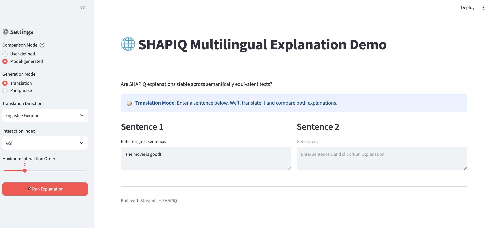
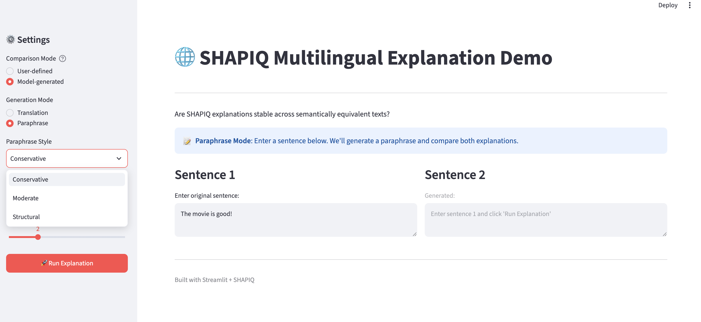
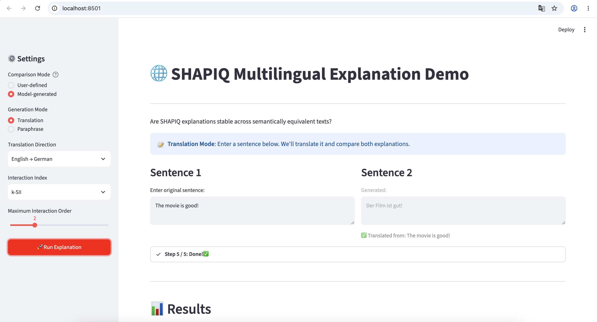
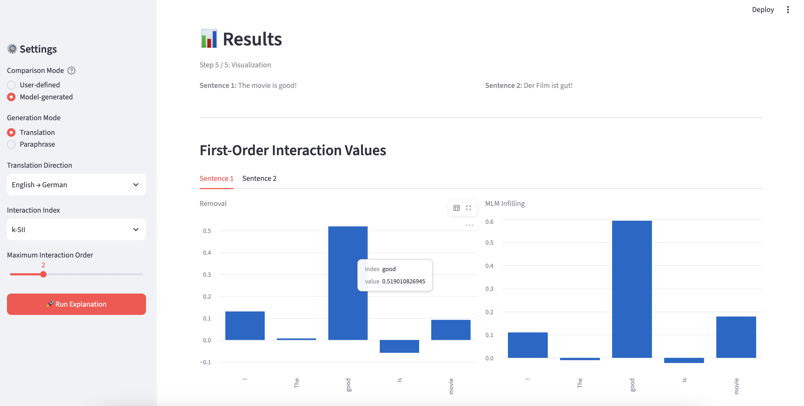
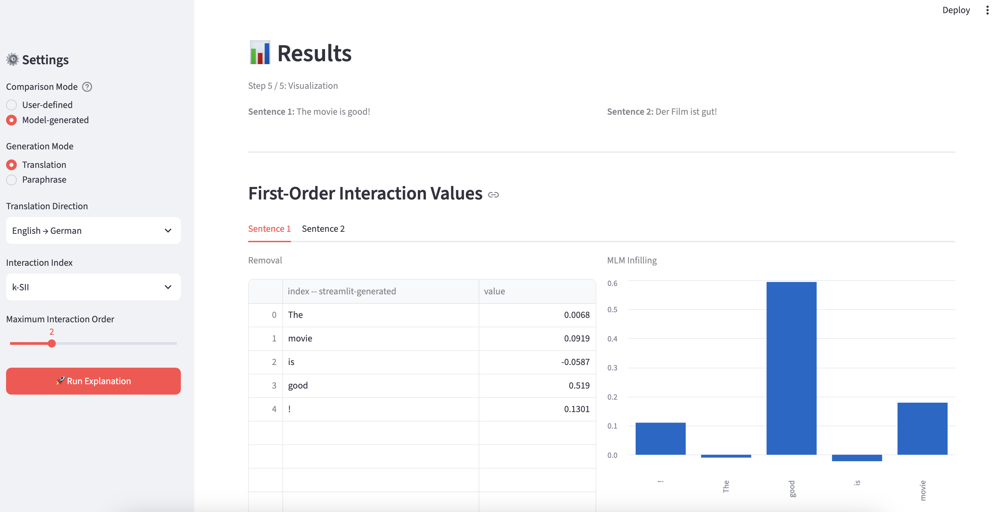
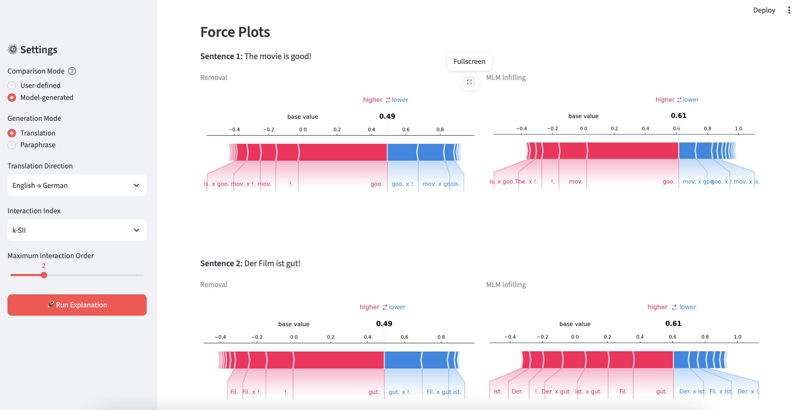

# 🌐 Multilingual Explanation Comparison Demo
------------------------------------------------------------------------

## 1. Overview

This demo is designed for the **Multilinguality & Robustness** topic
proposed in the SHAPIQ project.

The goal is not to evaluate machine translation or paraphrase quality
itself, but to investigate:

> Are SHAPIQ explanations, especially interaction values, stable across
> semantically equivalent texts such as translations or paraphrases?

The demo showcases the newly implemented `TextImputer` together with SHAPIQ interaction explanations.

------------------------------------------------------------------------

## 2. Getting Started

### Prerequisites

- Python 3.12 or higher
- Git
- Optional: conda for environment management

### Installation

#### Step 1: Clone the Repository

```bash
git clone https://github.com/ddddxx1/shapiq.git
cd shapiq
git checkout Multilingualdemo-Liang
```

#### Step 2: Set Up Environment

```bash
# Using conda (recommended)
conda create -n shapiq_demo python=3.12
conda activate shapiq_demo
```

#### Step 3: Install Dependencies

```bash
# Install from source (development mode)
pip install -e .

# Install extra dependencies for text explanation
pip install -e ".[text]"

# Or install all required packages directly
pip install torch transformers shapiq streamlit matplotlib numpy scipy nltk
```

#### Step 4: Set Python Path (if needed)

```bash
export PYTHONPATH=src:$PYTHONPATH
```
Note: The demo requires models to be downloaded on first run. Model caching is enabled, so subsequent runs will be faster.


### Usage

After installation, you can run the demo in two ways:

#### Web Interface (Recommended)

```bash
streamlit run demo/multilingual/app.py
```
You will see the Streamlit app running at http://localhost:8501 in your browser. (Google Chrome is better way to open it.)

#### Command Line Interface

```bash
PYTHONPATH=src python demo/multilingual/Multilingual_Expanation_Compasion.py
```

Follow the terminal prompts to compare explanations.

Note: If you encounter any issues or errors, please consult an AI assistant or refer to the error messages for troubleshooting.

------------------------------------------------------------------------

## 3. Usage

------------------------------------------------------------------------

### Step 1 — Choose a Comparison Mode

Two comparison modes are available.

#### User-defined Comparison

Enter two sentences manually.

Example:

```text
Sentence 1:  
The movie was fantastic.

Sentence 2: 
Der Film war fantastisch.
```

No text generation model is used.


#### Model-generated Comparison

Enter one original sentence. The second sentence is automatically generated.

Two generation modes are supported:

-   Translation

-   Paraphrase


---

### Step 2 — Select Generation Mode (Model-generated Only)

####  Translation

### Supported Languages & Models

The current implementation supports:

-   English → German by using Model:

``` text
Helsinki-NLP/opus-mt-en-de
```

-   German → English by using Model:

``` text
Helsinki-NLP/opus-mt-de-en
```

The translation models will be loaded only when translation mode is selected.


#### Paraphrase

The current implementation provides three paraphrase styles.

- Conservative
- Moderate
- Structural


### Paraphrase Model

``` text
Qwen/Qwen2.5-0.5B-Instruct
```

The prompt uses the tokenizer chat template and requests exactly one paraphrased sentence without explanations or quotation marks.Generated text cannot be manually edited inside the demo workflow.

---

### Step 3 — Configure Explanation Settings

#### Shapley Interaction Index

Supported indices:

- k-SII: k‑Shapley Interaction Index
- STII: Shapley‑Taylor Interaction Index

#### Maximum Interaction Order

Range:

```text
1–5
```

Default:

```text
2
```

### Step 4 — Compute Explanations

For each sentence, the demo automatically computes explanations using both perturbation strategies:

- Removal
- MLM Infilling

---


### Output & Visualization

The recommended way to explore the demo. Provides an interactive dashboard with real-time visualization.

After clicking **"Run Explanation"**, the following outputs are displayed:



**1. First-Order Interaction Values in two different views**





**2. SHAOIQ Force Plots (Interactive Visualizations)**




For two sentences and two perturbation strategies, a complete comparison therefore produces four explanation results saved in file:

- Sentence 1 + Removal
- Sentence 1 + MLM Infilling
- Sentence 2 + Removal
- Sentence 2 + MLM Infilling

------------------------------------------------------------------------

## 4. Models Summary

| Purpose | Model |
|---------|-------|
| **Explanation Model** | `lxyuan/distilbert-base-multilingual-cased-sentiments-student` |
| **English → German Translation** | `Helsinki-NLP/opus-mt-en-de` |
| **German → English Translation** | `Helsinki-NLP/opus-mt-de-en` |
| **Paraphrase** | `Qwen/Qwen2.5-0.5B-Instruct` |
| **MLM Infilling** | `bert-base-uncased` |

------------------------------------------------------------------------

## 5. Device & Demo Configuration

DEVICE = "cpu"

| Setting | Value | Description |
|---------|-------|-------------|
| Player Level | Word | Features are individual words |
| Perturbation Strategies | Removal + MLM Infilling | Both strategies run automatically |
| MLM Model | `bert-base-uncased` | BERT for context-aware infilling |
| MLM Samples | `3` (Debug) / `100` (Full) | Fast debug vs. accurate experiment |
| Default Interaction Index | k-SII | Standard Shapley interaction index |
| Default Maximum Order | 2 | Computes 1st and 2nd order interactions |
| Explanation Budget | 2048 | Sampling budget for SHAPIQ approximation |
| Class Index | 0 | Target class for explanation (positive sentiment) |

------------------------------------------------------------------------
